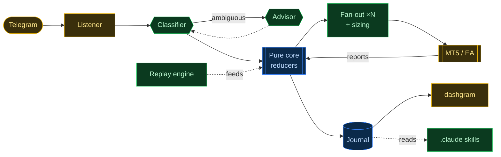
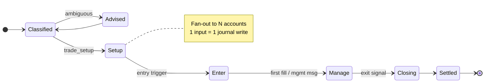
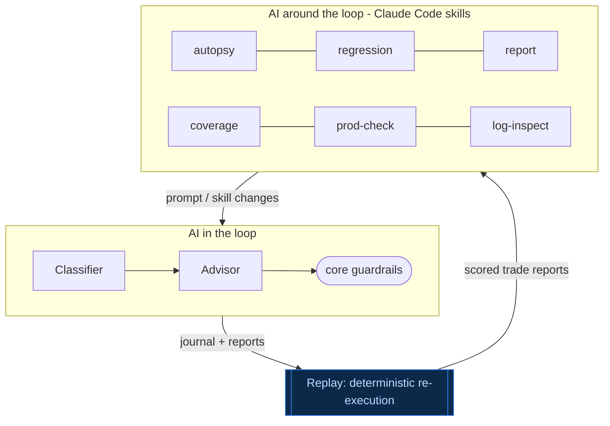
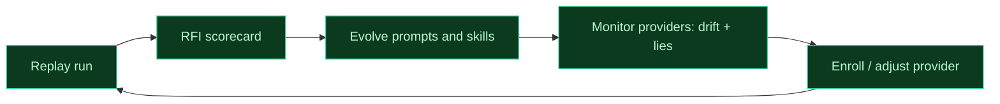

# TradeGram

Turning a **Telegram feed** into disciplined, **multi-account trade execution**

<div class="mt-8 text-lg opacity-80">
An event-sourced trading engine where <span class="text-cyan-400">two AIs run the loop</span>
— and <span class="text-emerald-400">every operational job is an AI skill</span>.
</div>

<!--
One-line positioning. This deck builds toward a single claim: the breadth of AI
automation. Not "we added a chatbot" — an entire operations surface (audit,
regression, provider monitoring, lie-detection, health, daily reports) is run by
AI skills, and a replay engine makes them all self-improving.
-->

---
layout: section
---

# Act 1 — The Problem

_A strategy you can only read, never run_

---

# Signal providers speak in messages, not orders

<div class="grid grid-cols-2 gap-8 mt-4">
<div>

<v-clicks>

- Traders sell **signals** in Telegram groups
- A "strategy" arrives as **free-form messages**:
  text, **edits**, voice notes, screenshots
- _"XAUUSD buy 2340–2338, SL 2330, TP1 2350, TP2 2360…"_
- Then a stream of follow-up: _"move SL to BE"_, _"close half"_, _"TP1 done ✅"_
- The edge decays in **seconds**; it never stops (24/7)

</v-clicks>

</div>
<div>

<v-click>

### A human can't keep up

Following this **reliably**, **at size**, across **many broker accounts**, without
fat-fingering or missing an edit — is the actual hard problem.

</v-click>

<v-click>

<div class="mt-6 p-4 rounded border border-rose-500/40 bg-rose-500/10">
The strategy is <b>trapped</b> inside an unstructured chat feed.
</div>

</v-click>

</div>
</div>

<div class="mt-6 pt-2 border-t border-gray-700 text-xs opacity-60">
<b>SL</b> Stop Loss · <b>TP</b> Take Profit · <b>BE</b> Break Even · <b>MT5</b> MetaTrader 5 · <b>EA</b> Expert Advisor (the MT5 bot)
</div>

<!--
Set up the pain. The interesting problem isn't "predict the market" — the provider
already did that. It's faithful, disciplined, multi-account REPLICATION of an
intent expressed as messy natural language, in real time.
-->

---
layout: statement
---

# A provider's strategy is _just messages_

<div class="text-xl opacity-80 mt-4">

Parse them → maintain **trade intent** → execute + manage → and you've **replicated** the strategy.

</div>

<div class="mt-8 text-cyan-400 text-lg">
That reframing is the whole system. Everything else is engineering discipline.
</div>

<!--
This is the thesis slide. Everything downstream — the core, the two AIs, the
skills, the flywheel — is in service of this one reframing.
-->

---
layout: section
---

# Act 2 — The Machine

_Architecture built for correctness and audit_

---

# What TradeGram does

<div class="text-base opacity-80 mb-4">One provider message, end to end:</div>

<v-clicks>

- **Classify** the message — new trade? setup detail? follow-up?
- Maintain an abstract **provider trade intent** (direction, entry, SL, TP ladder)
- **Fan out** that intent to every subscribed **MT5 account**
- Reduce to a per-account **executable order** (lot sizing, broker constraints, validation)
- Dispatch to **MT5 / the Expert Advisor**, consume **execution reports**
- Project everything into a **canonical journal** → history, metrics, dashboards

</v-clicks>

<div v-click class="mt-6 text-emerald-400">
Deterministic. Auditable. Recoverable. Every step is one input → one journal write.
</div>

<!--
This is the capability list. Note the shape: abstract intent at the provider level,
then fan-out to N accounts, then per-account resolution. Signal-once, execute-many.
-->

---

# System architecture



<div class="text-sm opacity-75 mt-2">
<span class="text-yellow-500">Leaf</span> = raw I/O ·
<span class="text-emerald-500">Shell</span> = orchestration + AI ·
<span class="text-blue-400">Core</span> = pure reducers.
The same core serves <b>live</b> and <b>replay</b>; skills read the journal it produces.
</div>

<!--
The one big map. Two things to point out: (1) the AI (classifier/advisor) sits in
the shell, never in the core; (2) the Replay engine feeds the exact same core as
live traffic — that identity is what makes replay trustworthy for regression.
-->

---

# An event-sourced core (FCIS)

<div class="grid grid-cols-2 gap-8">
<div>

<v-clicks>

- **Functional Core / Imperative Shell** — pure reducers decide _what happens_; the shell does all I/O
- One external input → **one journal write**. The **journal is canonical** and recovery-authoritative
- Rebuild all state by replaying the journal — no hidden mutable truth
- CI **forbids** `@anthropic-ai/sdk` imports in core packages — decisions stay pure & testable

</v-clicks>

</div>
<div>

<v-click>

<div class="p-4 rounded border border-blue-500/40 bg-blue-500/10">

### Why it matters

- **Reliability** — crash and rebuild from the journal
- **Auditability** — every decision is an event you can inspect
- **Testability** — pure functions, no mocks

</div>

</v-click>

<v-click>
<div class="mt-4 text-cyan-400 text-sm">
This purity is exactly what makes deterministic replay possible.
</div>
</v-click>

</div>
</div>

<!--
Sell the architecture quality. The FCIS boundary isn't dogma — it's what buys
reliability (rebuild from journal), auditability (events), and the replay
determinism that the entire second half of the deck depends on.
-->

---

# Deterministic replay — the superpower

<div class="grid grid-cols-2 gap-6 items-center">
<div>

<v-clicks>

- Re-inject recorded **Telegram messages** _and_ **historical quote ticks** at their **original timestamps**
- The **same core** processes them — live and replay are indistinguishable to the engine
- Speed zones: slow around messages, **fast-forward** the quiet gaps
- Output: a full **trade-report JSON** — state, AI decisions, execution trail

</v-clicks>

</div>
<div>

<v-click>

```bash
replay scenario \
  --group alpha-signals \
  --messages 1420-1435 \
  --symbol XAUUSD \
  --inspect --output report.json
```

<div class="mt-4 p-3 rounded border border-emerald-500/40 bg-emerald-500/10 text-sm">
Any historical day becomes a <b>repeatable test</b> —
before a single change touches real money.
</div>

</v-click>

</div>
</div>

<!--
Replay is the hinge of the whole talk. Because the core is pure and journal-driven,
re-running history is exact. This unlocks regression testing AND the entire Plane-2
automation story that follows.
-->

---

# One trade, end to end



<div class="text-sm opacity-75 mt-2">
Each transition is an atomic journal write. History-builders project trade timelines
straight from those events.
</div>

<!--
The trade lifecycle. Classify (maybe advise if ambiguous) -> setup -> enter ->
manage -> closing -> settled. The fan-out to N accounts happens off the provider-side
intent; each account resolves independently.
-->

---
layout: section
---

# Act 3 — AI Plane 1

_Two AIs inside the trading loop — on rails_

---

# Two AIs run the loop

<div class="grid grid-cols-2 gap-6 mt-2">
<div class="p-4 rounded border border-cyan-500/40 bg-cyan-500/10">

### 🧭 Classifier

Reads each incoming message, emits one of:

- `new_trade` — a fresh signal
- `trade_setup` — entry / SL / TP detail
- `follow-up` — management, results, noise

<div class="text-xs opacity-70 mt-2">One serialized queue per provider.</div>

</div>
<div class="p-4 rounded border border-fuchsia-500/40 bg-fuchsia-500/10">

### 🛠 Advisor

Decides management actions via **7 structured tools**:

<div class="text-sm">

`move_to_break_even` · `update_stop_loss` · `update_take_profit` · `close_positions` · `update_entry` · `abort_trade` · `set_setup`

</div>

<div class="text-xs opacity-70 mt-2">One serialized queue per trade.</div>

</div>
</div>

<div v-click class="mt-6 text-center text-lg">
Both run <span class="text-cyan-400">Claude Haiku 4.5</span> at
<span class="text-emerald-400">temperature 0.2</span> — measured to roughly
<b>halve decision flip-flop</b> vs. the default.
</div>

<!--
Two distinct roles, same model. Classifier routes; advisor acts via a fixed tool
vocabulary. Temperature 0.2 was empirically tuned for determinism/predictability —
this matters because replay compares runs.
-->

---

# One general brain, specialized per provider

<div class="grid grid-cols-2 gap-6 items-center">
<div>

<v-clicks>

- A **master prompt** encodes the universal rules (classification + trade management)
- Each provider adds a small **override**: its vocabulary, emoji, price formats, quirks
- Master merges the provider block via a `{{providerPrompt}}` placeholder
- **9 providers** onboarded today — each is a prompt pair, not new code

</v-clicks>

</div>
<div>

```text
prompts/
├─ master/
│  ├─ classification.md   # universal
│  └─ trading.md
└─ providers/
   ├─ alpha-signals/
   │  ├─ classification.md # overrides
   │  └─ trading.md
   ├─ provider-b/ …
   └─ provider-c/ …
```

<div v-click class="mt-3 text-sm text-cyan-400">
Enrolling a provider = author a prompt pair.
</div>

</div>
</div>

<!--
Prompt layering: general + per-provider. The key portfolio point is that adding a
provider is a config+prompt exercise, not an engineering one — which is what makes
the enrollment side of the flywheel cheap.
-->

---

# AI safely on rails

<div class="grid grid-cols-3 gap-4 mt-6">
<div v-click class="p-4 rounded border border-emerald-500/40 bg-emerald-500/10">

### Confined to the shell

AI only ever runs in the imperative shell. The **pure core** holds the decisions.

</div>
<div v-click class="p-4 rounded border border-blue-500/40 bg-blue-500/10">

### Guardrailed intents

Every advisor tool-call is **validated by the core** against strategy rules before it becomes an event.

</div>
<div v-click class="p-4 rounded border border-yellow-500/40 bg-yellow-500/10">

### Enforced by CI

Importing an AI SDK into a core package **fails the build**. The boundary can't rot.

</div>
</div>

<div v-click class="mt-8 text-center text-lg">
The AI proposes. The <span class="text-blue-400">deterministic core</span> disposes.
</div>

<!--
This is the "I make AI production-safe" slide. LLMs are non-deterministic and can
hallucinate; the architecture contains that: shell-only, core-validated, CI-enforced.
Low temperature on top. AI proposes, the core disposes.
-->

---
layout: section
---

# Act 4 — AI Plane 2

_Around the loop: every ops job is an AI skill_

---

# Two planes of AI



<div class="text-sm opacity-75 mt-2">
Plane 1 <b>runs</b> the trades. Plane 2 <b>audits, tests and evolves</b> the system.
<span class="text-cyan-400">Replay is the bridge</span> between them.
</div>

<!--
The pivotal diagram. Most systems stop at Plane 1. TradeGram's distinctive bet is
Plane 2: the operations surface is itself AI. Replay connects them — it turns live
history into scored artifacts the skills reason over.
-->

---
layout: fact
---

# Every operational role → an AI skill

<div class="grid grid-cols-2 gap-3 mt-6 text-left text-sm">
<div v-click class="p-3 rounded border border-cyan-500/30 bg-cyan-500/5">
🔬 <b>trade-autopsy</b> — post-mortem analyst <span class="opacity-60">(per-trade forensic review)</span>
</div>
<div v-click class="p-3 rounded border border-cyan-500/30 bg-cyan-500/5">
🧪 <b>trade-regression</b> — QA engineer <span class="opacity-60">(RFI scorecards across versions)</span>
</div>
<div v-click class="p-3 rounded border border-cyan-500/30 bg-cyan-500/5">
📊 <b>trade-report</b> — performance analyst + auditor <span class="opacity-60">(P&L, provider honesty)</span>
</div>
<div v-click class="p-3 rounded border border-cyan-500/30 bg-cyan-500/5">
🔎 <b>trade-signal-coverage</b> — prompt engineer <span class="opacity-60">(vocabulary/drift gaps)</span>
</div>
<div v-click class="p-3 rounded border border-cyan-500/30 bg-cyan-500/5">
🚦 <b>trade-prod-check</b> — SRE <span class="opacity-60">(point-in-time health probe)</span>
</div>
<div v-click class="p-3 rounded border border-cyan-500/30 bg-cyan-500/5">
📟 <b>trade-log-inspect</b> — on-call engineer <span class="opacity-60">(daily log + failure sweep)</span>
</div>
</div>

<div v-click class="mt-6 text-center text-lg text-emerald-400">
A whole ops team — as invokable AI skills.
</div>

<!--
THE emphasis slide — this is the #1 takeaway (breadth of AI automation). Land it
slowly, one role at a time. Each human job on a trading desk / ops team maps to a
skill that already exists in .claude/skills.
-->

---

# AI that watches the providers

<div class="grid grid-cols-2 gap-6 mt-2">
<div class="p-4 rounded border border-rose-500/40 bg-rose-500/10">

### 🕵️ Lie-detection — `trade-report`

Compares the provider's **announced** outcome to the **replayed** result.

- Flags results that **could never have happened** (a TP "hit" at a price never traded)
- Computes a **loss-honesty rate** per provider
- Detects SL typos & implausible entries

</div>
<div class="p-4 rounded border border-amber-500/40 bg-amber-500/10">

### 📡 Drift-detection — `trade-signal-coverage`

Diffs live message **vocabulary** against the prompts.

- New emoji / price formats / extra TP levels
- **Dead prompt rules** that stopped matching
- Tool / prompt misalignment before it costs a trade

</div>
</div>

<div v-click class="mt-6 text-center">
We don't just follow providers — <span class="text-cyan-400">we grade them, and grade ourselves against them.</span>
</div>

<!--
This is the "sophistication" beat: the system is skeptical of its own data sources.
Providers lie or drift; AI skills catch both. RFI (next act) measures how well WE
followed instructions, independent of whether the provider was honest.
-->

---
layout: section
---

# Act 5 — The Flywheel

_A system that improves itself_

---

# The self-improving loop



<div class="grid grid-cols-2 gap-8 mt-4 text-sm">
<div v-click>

**RFI — Replication Fidelity Index** _(adherence, not P&L)_

- Classification **30%** · Action fidelity **30%**
- Execution **25%** · State consistency **15%**
- Excellent 95–100 · Good 85–94 · Fair 70–84 · Poor &lt;70

</div>
<div v-click>

**Why it compounds**

- Replay makes every change **testable before real money**
- RFI turns _"did we get better?"_ into a **number**
- New provider = a prompt pair the loop then **tunes**

</div>
</div>

<!--
The payoff. The breadth of Plane-2 skills isn't a pile of tools — it's a closed
loop. Replay produces scored runs (RFI), which drive prompt/skill evolution, which
is validated by re-running replay. Provider monitoring feeds enrollment/adjustment.
The system's fidelity ratchets upward, safely.
-->

---
layout: statement
---

# Change → replay → RFI → ship

<div class="text-xl opacity-80 mt-4">

No prompt, skill, or engine change reaches production without a **fidelity score**
on real historical trades.

</div>

<div class="mt-8 text-emerald-400 text-lg">
Breadth of AI automation × deterministic replay = compounding quality.
</div>

<!--
Restate the flywheel as a shipping discipline. This is the regression-gate story:
RFI is the CI for trading behavior.
-->

---
layout: section
---

# Act 6 — Vision

_Unattended operations_

---

# Autonomous operations

<div class="grid grid-cols-3 gap-4 mt-6">
<div v-click class="p-4 rounded border border-emerald-500/40 bg-emerald-500/10">

### 🩺 Health monitor

Continuously watches **Telegram, MT5, and the database** — and self-reports degradation.

</div>
<div v-click class="p-4 rounded border border-blue-500/40 bg-blue-500/10">

### 🧹 Log sweep

Scans logs for **crashes and error spikes**, correlates them, and surfaces what broke.

</div>
<div v-click class="p-4 rounded border border-cyan-500/40 bg-cyan-500/10">

### 🌅 Daily report

Every morning, an AI **post-mortems yesterday's trades** and ships the summary — unattended.

</div>
</div>

<div v-click class="mt-8 text-center text-lg">
The operator's job becomes <span class="text-cyan-400">reading AI reports</span>, not running commands.
</div>

<!--
Vision slide, presented as existing capability per the unified-vision framing. The
direction: the same skills that an operator invokes on demand run on a schedule and
push their findings. The human moves up the stack to judgment.
-->

---
layout: center
class: text-center
---

# The one line

<div class="text-2xl mt-6 leading-relaxed">
Every operational job in TradeGram is an <span class="text-cyan-400">AI skill</span> —<br/>
and <span class="text-emerald-400">deterministic replay</span> makes them all <b>self-improving</b>.
</div>

<div class="mt-10 text-base opacity-70">
Telegram → two AIs on rails → MetaTrader 5 · an event-sourced core · a flywheel that ratchets fidelity upward
</div>

<div class="abs-br m-6 text-sm opacity-50">
TradeGram · systems + applied-AI portfolio
</div>

<!--
Close on the takeaway verbatim. If they remember one sentence, this is it.
-->
